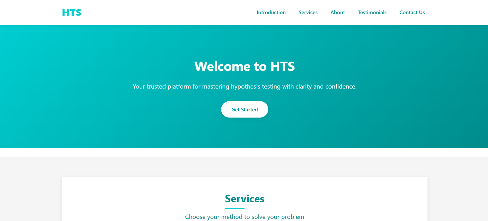
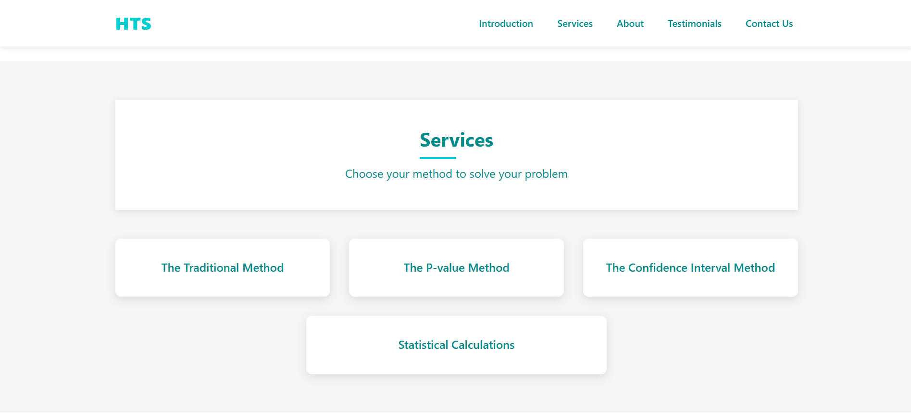
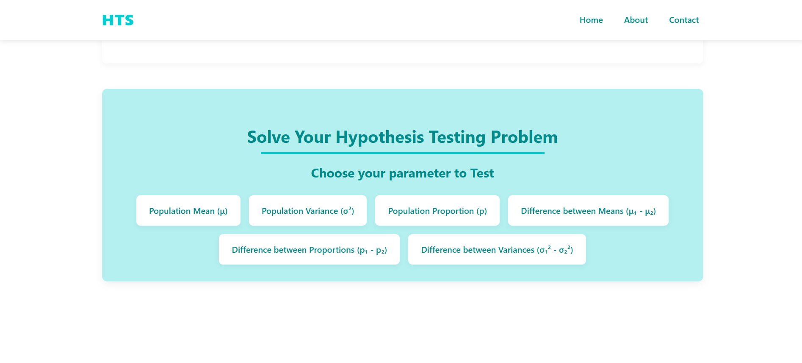

# HTS - Hypothesis Testing Solver 🧠📊

**HTS (Hypothesis Testing Solver)** is a web-based platform that helps users perform and understand hypothesis testing using three different methods: the Traditional Method, P-value Method, and Confidence Interval Method. It is designed to guide users through each statistical approach clearly and interactively, complete with visualizations and step-by-step calculations.

---

## 🔍 Features

- ✅ Supports 3 key hypothesis testing methods:
  - **Traditional Method**
  - **P-value Method**
  - **Confidence Interval Method**

- 📘 For each method, we explain:
  - What the method is
  - Why and when to use it
  - The step-by-step calculation process

- 📊 Test the following **6 statistical parameters**:
  - Population Mean (μ)
  - Population Variance (σ²)
  - Population Proportion (p)
  - Difference between Means (μ₁ − μ₂)
  - Difference between Proportions (p₁ − p₂)
  - Difference between Variances (σ₁² − σ₂²)

- 🔢 **Statistical Calculations Page**:
  - Enter raw data (comma or space separated)
  - Calculate: Mean, Variance, Standard Deviation
  - Automatically sorts and counts your data

- 📈 Visualizations using `matplotlib` for hypothesis test results

- 🧮 Each result page clearly displays:
  - Relevant test statistics (e.g., test value, p-value) based on the selected method
  - Critical values
  - Decision results
  - All steps used in the test

---

## 💻 Technologies Used

- **Frontend:** HTML, CSS, JavaScript  
- **Backend:** Python (Flask)  
- **Visualization:** matplotlib

---

## 🚀 Getting Started

1. Download or clone the repository.
2. Open the project folder (`HTS`) in **VS Code** or any Python-supported IDE.
3. Install the required Python packages:

```bash
pip install flask matplotlib
```
4. Run the app using the following command in the terminal:
```bash
python app.py
```
5. Open your browser and go to:
```bash
http://localhost:5000
```
# HTS Platform Screenshots  

## Screenshot 1: Welcome Page  
  
The HTS homepage with a welcoming message.  

---  

## Screenshot 2: Services Overview  
  
Lists available hypothesis testing methods (Traditional, P-value, Confidence Interval).  

---  

## Screenshot 3: Parameter Selection  
  
Interface for selecting statistical parameters (Mean, Variance, Proportion, etc.).  

## 👨‍💻 Team

### [**Abdelrahmen Elashry**](https://www.linkedin.com/in/abdelrahmen-elashry/)  
📧 **abdelrahmenelashry@gmail.com**  
*Student at Faculty of Science, Mansoura University*  
*Statistics and Computer Science Program*

### [**Sofyan Kirat**](https://www.linkedin.com/in/sofyankirat/)
📧 **www.sofyankirat123@gmail.com**  
*Student at Faculty of Science, Mansoura University*  
*Statistics and Computer Science Program*

---

## 🧠 Why We Built This

As students passionate about statistics and data science, we built **HTS** to simplify the hypothesis testing process for learners, analysts, and educators. This platform not only performs the tests but also teaches the logic behind them with clarity, precision, and visual feedback.

---

## 📌 License

This project is open-source and free to use for learning purposes.

---

## 💬 Feedback

We’d love to hear your feedback or ideas for future improvements.

Feel free to contact us via email or LinkedIn (Just click our names in Team section)!
